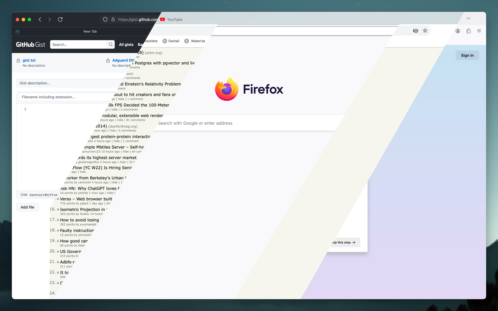

# Firefox Profile Creator - Build the best firefox in seconds!

<div align=center>
    <a href="img.png">
        
    </a>
    <center><i>The end-all firefox configurator! - See <a href="https://asciinema.org/a/671838">it in action</a></i></center>
    <hr/>
</div>
<br><br>

Basically an interactive CLI program that generates a [`config.json` file](examples/my-config/config.jsonc) which is then processed and [built into](run.js) a Firefox Profile folder. **[Install](https://github.com/Explosion-Scratch/firebuilder/releases/tag/latest)**

## **Features**:

- 🖊️ **userChrome**: Pick and choose from CSS tweaks
- ⚙️ **user.js**: Apply firefox hardening - Sensible defaults are included, intended to leave all functionality but remove tracking
- ☁️ **Install from repos**: Basically any git repo you can think of, this supports installing userChrome, user.js, etc, from it (and [customizing](examples/set-theme-prefs/config.jsonc))
- ⚡ **Install fx-autoconfig**: Install fx-autoconfig for browser .uc.js files.
- 🔄 **Install `.uc.js` files from repos**: See [examples/uc.js-scripts](examples/uc.js-scripts/config.jsonc) for an example.
- 📈 **Extend an existing profile**: This tool can copy bookmarks, history, passwords, extensions and cookies from an existing Profile ([example](examples/extend-profile/config.jsonc))
- 🫥 **Start with defaults (or not)**: You can start customizing based on [sensible defaults](examples/extend-default/config.jsonc) or [vanilla firefox](examples/vanilla-firefox/config.jsonc)

## **Getting started**:
Download a binary for your platform from  [releases](https://github.com/Explosion-Scratch/firebuilder/releases/tag/latest)

> Shameless plug: You can install this in one command using my tool [justinstall](https://github.com/explosion-scratch/justinstall) by running `justinstall explosion-scratch/firebuilder`

**Or**:
Run `bun cli.js` for an interactive setup or see [examples](examples/README.md). To use a configuration from examples you can run `bun cli.js examples/my-config/config.jsonc`.
```
git clone https://github.com/Explosion-Scratch/firebuilder
cd firebuilder
# Or if you want to use my config with no interactivity: bun cli.js examples/my-config/config.jsonc --launch`
bun cli.js
```

## Contributing
- See [CONTRIBUTING.md](CONTRIBUTING.md) for details. Basically it's pretty simple, add your thing via a json/js file and make sure it has a handler


## Want something added?
Just ask me (in an issue) I'll try to add it or make a PR!
